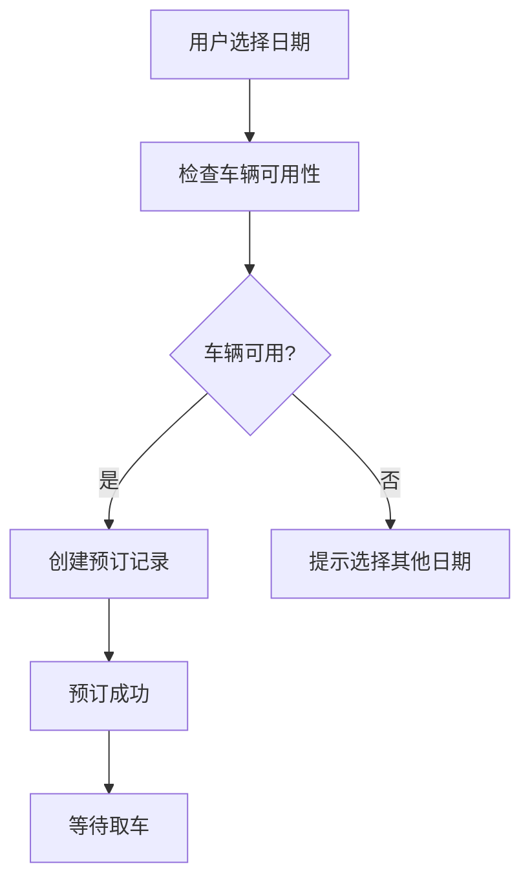
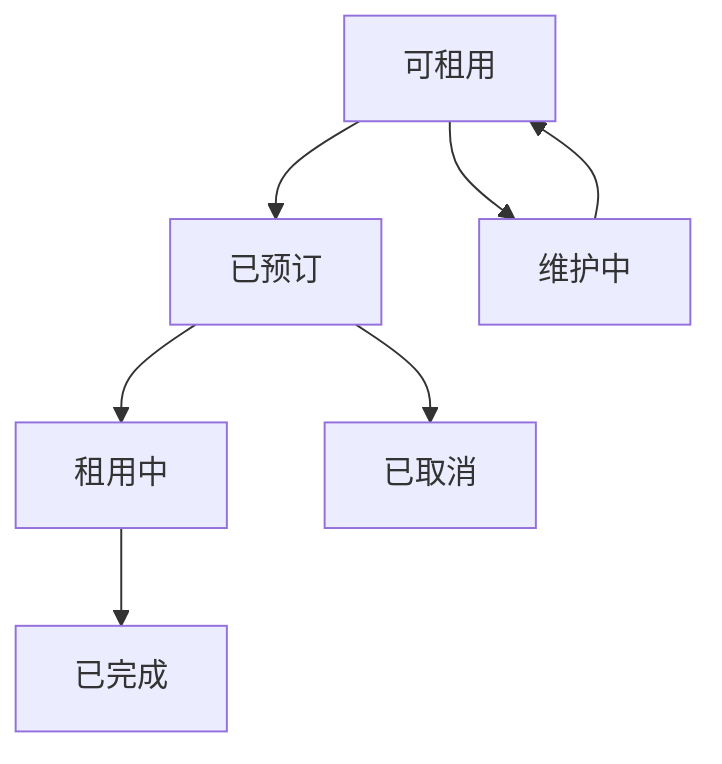

# 车辆库存管理系统设计文档

## 📋 概述

车辆库存管理系统是ZuLMe租车平台的核心功能模块，负责管理车辆的可用性、预订状态、租用状态和维护计划，确保车辆资源的合理分配和高效利用。

## 🎯 核心功能

### 1. 库存状态管理
- **可租用** (1) - 车辆空闲，可以预订
- **已预订** (2) - 车辆被预订但还未取车
- **租用中** (3) - 车辆正在被使用
- **维护中** (4) - 车辆在保养或维修
- **不可用** (5) - 车辆暂时下架

### 2. 时间段库存控制
- ✅ 基于日期范围的库存管理
- ✅ 预订冲突检测
- ✅ 自动库存状态更新
- ✅ 维护计划管理

### 3. 实时可用性检查
- ✅ 即时查询车辆可用性
- ✅ 批量获取可用车辆
- ✅ 智能冲突避免
- ✅ 库存统计分析

## 🏗️ 技术架构

### 数据库设计

#### 车辆库存表 (vehicle_inventories)
```sql
CREATE TABLE `vehicle_inventories` (
  `id` bigint unsigned NOT NULL AUTO_INCREMENT,
  `vehicle_id` bigint unsigned NOT NULL COMMENT '车辆ID',
  `start_date` date NOT NULL COMMENT '开始日期',
  `end_date` date NOT NULL COMMENT '结束日期',
  `status` tinyint DEFAULT '1' COMMENT '库存状态',
  `order_id` bigint unsigned DEFAULT '0' COMMENT '关联订单ID',
  `quantity` int DEFAULT '1' COMMENT '数量',
  `notes` varchar(500) DEFAULT NULL COMMENT '备注',
  `created_by` bigint unsigned DEFAULT NULL COMMENT '创建人ID',
  `updated_by` bigint unsigned DEFAULT NULL COMMENT '更新人ID',
  -- 索引和约束
  KEY `idx_vehicle_date_status` (`vehicle_id`, `start_date`, `end_date`, `status`),
  KEY `idx_date_range` (`vehicle_id`, `start_date`, `end_date`)
);
```

#### 核心索引策略
- **复合索引**: `(vehicle_id, start_date, end_date, status)` - 优化可用性查询
- **日期范围索引**: `(start_date, end_date)` - 优化时间段查询
- **状态索引**: `(status)` - 优化状态筛选

### 后端架构

#### 1. 模型层 (Model)
```go
type VehicleInventory struct {
    VehicleID   uint      `json:"vehicle_id"`
    StartDate   time.Time `json:"start_date"`
    EndDate     time.Time `json:"end_date"`
    Status      int       `json:"status"`
    OrderID     uint      `json:"order_id"`
    // ... 其他字段
}
```

#### 2. 核心业务方法
- `CheckAvailability()` - 检查车辆可用性
- `CreateReservation()` - 创建预订记录
- `UpdateReservationToRented()` - 更新为租用状态
- `CompleteRental()` - 完成租用
- `GetAvailableVehicles()` - 获取可用车辆列表

#### 3. API接口设计
```go
// 检查车辆可用性
rpc CheckAvailability(CheckAvailabilityRequest) returns(CheckAvailabilityResponse);

// 创建预订
rpc CreateReservation(CreateReservationRequest) returns(CreateReservationResponse);

// 获取可用车辆
rpc GetAvailableVehicles(GetAvailableVehiclesRequest) returns(GetAvailableVehiclesResponse);
```

### 前端架构

#### 1. 组件设计
- `VehicleAvailability` - 车辆可用性检查组件
- `InventoryCalendar` - 库存日历视图
- `InventoryStats` - 库存统计面板

#### 2. 状态管理
```javascript
const statusConfig = {
  1: { text: '可租用', color: 'green', icon: <CheckCircleOutlined /> },
  2: { text: '已预订', color: 'orange', icon: <ClockCircleOutlined /> },
  3: { text: '租用中', color: 'blue', icon: <CarOutlined /> },
  4: { text: '维护中', color: 'purple', icon: <ToolOutlined /> },
  5: { text: '不可用', color: 'red', icon: <StopOutlined /> }
};
```

## 🔄 业务流程

### 1. 用户预订流程


### 2. 库存状态变更流程


### 3. 冲突检测算法
```sql
-- 检查日期范围冲突
SELECT COUNT(*) FROM vehicle_inventories
WHERE vehicle_id = ? AND status IN (2,3,4)
AND (
    (start_date <= ? AND end_date >= ?) OR  -- 新开始日期在现有范围内
    (start_date <= ? AND end_date >= ?) OR  -- 新结束日期在现有范围内  
    (start_date >= ? AND end_date <= ?)     -- 新范围包含现有范围
);
```

## 🎨 用户界面特性

### 1. 可用性检查界面
- 📅 日期范围选择器
- ✅ 实时可用性反馈
- 📊 可视化状态显示
- 🔄 自动刷新机制

### 2. 库存日历视图
- 📆 月度日历展示
- 🏷️ 状态标记显示
- 📝 预订详情查看
- 🎨 颜色编码状态

### 3. 统计面板
- 📈 实时库存统计
- 📊 可用率分析
- 🎯 预订趋势图
- 💰 收益统计

## 🚀 使用示例

### 1. 检查车辆可用性
```javascript
const checkAvailability = async () => {
  const response = await vehicleService.checkAvailability({
    vehicle_id: 1,
    start_date: '2024-01-15',
    end_date: '2024-01-18'
  });
  
  if (response.data.is_available) {
    // 车辆可用，可以预订
  } else {
    // 车辆不可用，提示用户
  }
};
```

### 2. 创建预订
```javascript
const createReservation = async () => {
  const response = await vehicleService.createReservation({
    vehicle_id: 1,
    order_id: 123,
    user_id: 456,
    start_date: '2024-01-15',
    end_date: '2024-01-18'
  });
};
```

### 3. 获取可用车辆
```javascript
const getAvailableVehicles = async () => {
  const response = await vehicleService.getAvailableVehicles({
    start_date: '2024-01-15',
    end_date: '2024-01-18',
    brand_id: 1,
    type_id: 3
  });
  
  // 显示可用车辆列表
  setVehicles(response.data.vehicles);
};
```

## 📊 性能优化

### 1. 数据库优化
- **索引策略**: 针对查询模式优化的复合索引
- **分区表**: 按日期分区提高查询性能
- **存储过程**: 复杂查询逻辑封装
- **视图优化**: 预计算统计数据

### 2. 缓存策略
- **Redis缓存**: 热点车辆可用性数据
- **本地缓存**: 库存状态配置数据
- **CDN缓存**: 静态资源和图片
- **查询缓存**: 频繁查询结果缓存

### 3. 前端优化
- **虚拟滚动**: 大量车辆列表优化
- **懒加载**: 按需加载库存数据
- **防抖处理**: 避免频繁API调用
- **状态管理**: 优化组件渲染

## 🔧 部署配置

### 1. 数据库初始化
```bash
# 创建库存表
mysql -u username -p database_name < create_vehicle_inventory_table.sql

# 插入测试数据
mysql -u username -p database_name < insert_inventory_test_data.sql
```

### 2. 后端配置
```yaml
# 库存管理配置
inventory:
  check_interval: 300  # 库存检查间隔(秒)
  cache_ttl: 600      # 缓存过期时间(秒)
  max_advance_days: 90 # 最大提前预订天数
```

### 3. 前端配置
```javascript
// 库存管理配置
const inventoryConfig = {
  refreshInterval: 30000,  // 自动刷新间隔
  maxDateRange: 30,        // 最大日期范围
  defaultPageSize: 12      // 默认分页大小
};
```

## 🔮 未来扩展

### 1. 智能推荐
- [ ] 基于历史数据的需求预测
- [ ] 智能定价策略
- [ ] 个性化车辆推荐
- [ ] 动态库存调配

### 2. 高级功能
- [ ] 批量操作支持
- [ ] 库存预警机制
- [ ] 自动维护计划
- [ ] 多仓库管理

### 3. 数据分析
- [ ] 库存利用率分析
- [ ] 收益优化建议
- [ ] 市场需求分析
- [ ] 竞争对手分析

## 📝 总结

车辆库存管理系统为ZuLMe平台提供了：

1. **精确的库存控制** - 避免超售和冲突
2. **实时的可用性查询** - 提升用户体验
3. **智能的状态管理** - 自动化业务流程
4. **全面的数据统计** - 支持业务决策
5. **灵活的扩展能力** - 适应业务发展

该系统确保了车辆资源的最优利用，为用户提供了可靠的租车服务，为商家提供了高效的管理工具。
